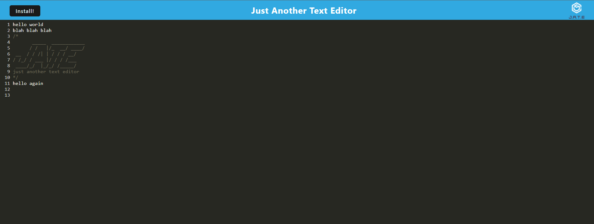

# JATE PWA

## Description

JATE is a text editor that meets PWA criteria and utilizes the IndexedDB database to store persistant data.

## Installation

To download JATE, simply click install on the upper left side of the app or on the right side of the url bar. After download, you'll find the shortcut on your desktop or home screen.

## Usage

To visit the website, [click here](link goes here)! Simply type anything you'd like in the text editor, and JATE will store your notes for future reference.

